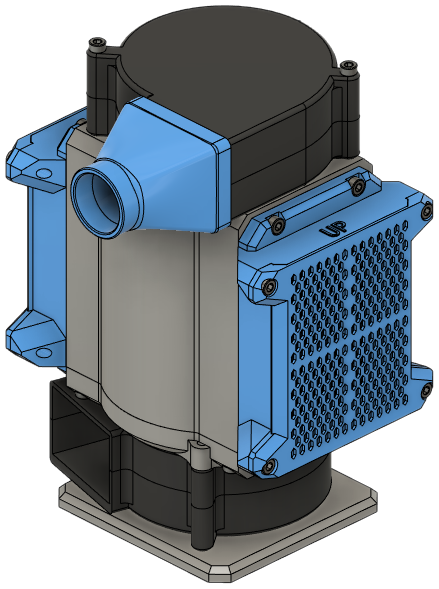

## Materials

| Part | Qty |
|------|-----|
| [Radial 75mm x 30mm fan][bom_7530_fan]            | 2 ea |
| [Moosoo XL-618A HEPA Filter][bom_hepa]            | 1 ea |
| M3 x 35mm SHCS                                    | 4 ea |
| M3 x 6mm SHCS                                     | 20 ea |
| [Heat set inserts, M3 x 5mm x 4mm][bom_inserts]   | 24 ea |
| [Acid-free coconut shell activated carbon][bom_carbon] | < 0.5kg/1lb |
| [`main_body.stl`][stl_main_body]                  | 1 ea |
| [`fan_cap.stl`][stl_fan_cap]                      | 1 ea |
| [`fan_base.stl`][stl_fan_base]                    | 1 ea |
| [`filter_base.stl`][stl_filter_base]              | 2 ea |
| [`filter_cover.stl`][stl_filter_cover]            | 2 ea |

### Optional

| Part | Qty |
|------|-----|
| [1"/25mm silicone tubing][bom_tubing]             | 1 m |
| [`exhaust_coupler.stl`][stl_exhaust_coupler]      | 1 ea |
