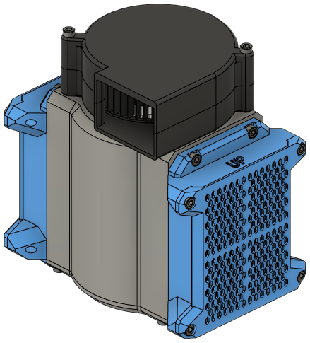

## Materials

| Part | Qty |
|------|-----|
| [Radial 75mm x 30mm fan][bom_7530_fan]            | 1 ea |
| [Moosoo XL-618A HEPA Filter][bom_hepa]            | 1 ea |
| M3 x 35mm SHCS                                    | 2 ea |
| M3 x 6mm SHCS                                     | 20 ea |
| [Heat set inserts, M3 x 5mm x 4mm][bom_inserts]   | 22 ea |
| Acid-free activated carbon                        | Varies |
| [`main_body.stl`][stl_main_body]                  | 1 ea |
| [`simple_cap.stl`][stl_simple_cap]                    | 1 ea |
| [`filter_base.stl`][stl_filter_base]                  | 2 ea |
| [`filter_cover.stl`][stl_filter_cover]                | 2 ea |
