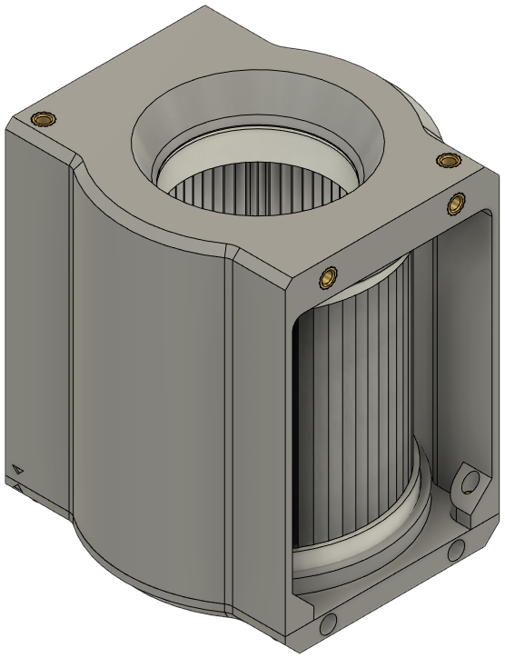
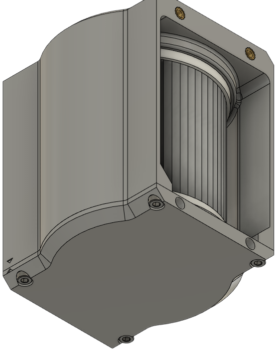
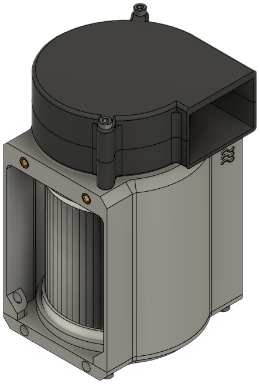
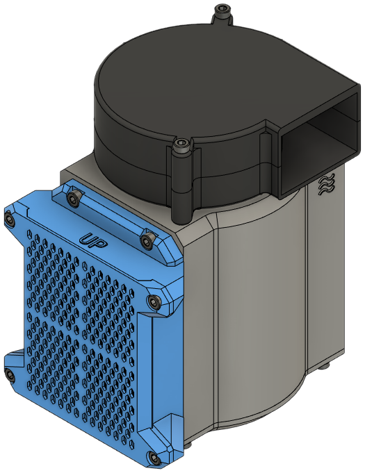
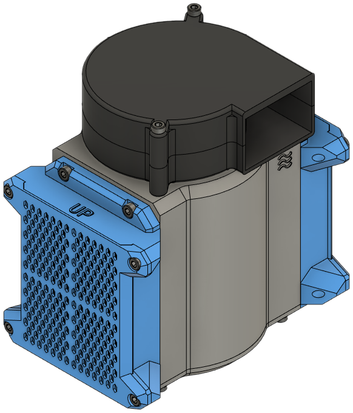

## Activated Carbon Filter

<figure markdown>

<figcaption markdown>
Step 1. Fill the filter with activated carbon until nearly overflowing.
</figcaption>
</figure>

<figure markdown>

<figcaption markdown>
Step 2. Place the cover over the filter. Secure with four (4) M3 x 6mm SHCS.
</figcaption>
</figure>

## Filter Body

<figure markdown>

<figcaption markdown>
Step 1. Fit the HEPA filter on to the cap. It should be a snug fit.
</figcaption>
</figure>

<figure markdown>

<figcaption markdown>
Step 2. Note the arrow in the bottom left corner. Align the arrows on the cap and main body while pressing them together. 
</figcaption>
</figure>

<figure markdown>

<figcaption markdown>
Step 3. Secure the cap and main body with four (4) M3 x 6mm SHCS.
</figcaption>
</figure>

<figure markdown>

<figcaption markdown>
Step 4. Place your radial fan over the fan inlet. The airflow symbol should be directly under the fan. Secure with two (2) M3 x 35mm SHCS.
</figcaption>
</figure>

<figure markdown>

<figcaption markdown>
Step 5. Secure a filter to one side with four (4) M3 x 6mm SHCS.
</figcaption>
</figure>

<figure markdown>

<figcaption markdown>
Step 6. Repeat with the second filter and four (4) more M3 x 6mm SHCS.
</figcaption>
</figure>
