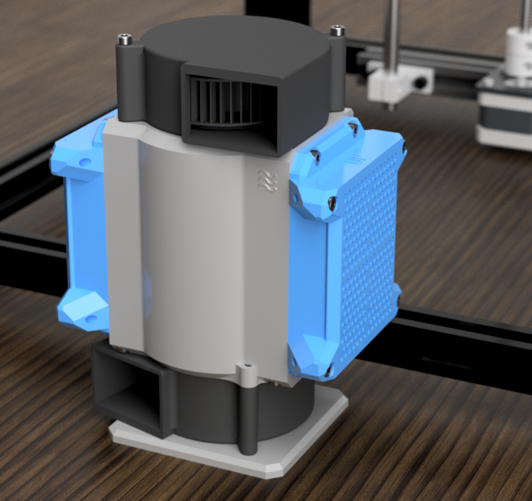

SUAFT is an activated carbon and HEPA filter for 3D printer enclosures.

## Goals

1. Be simple and efficient.
2. Be easy to build.
3. Be cheap to source.

## Bill of Materials

The filter can be printed with either one or two fans. The second fan can be used to provide additional airflow or act as a controlled chamber exhaust fan.

A method of mounting the filter to 2020 extrusions is coming soon.

[Single Fan BOM](single.md){ .md-button }

[Dual Fan BOM](dual.md){ .md-button }

## Assembly

Print SUAFT with ASA, ABS, or PETG. If your enclosure regularly reaches 60C, ASA is recommended.

[Heat Set Insert Locations](inserts.md){ .md-button }

[Assembly Guide](assembly.md){ .md-button }