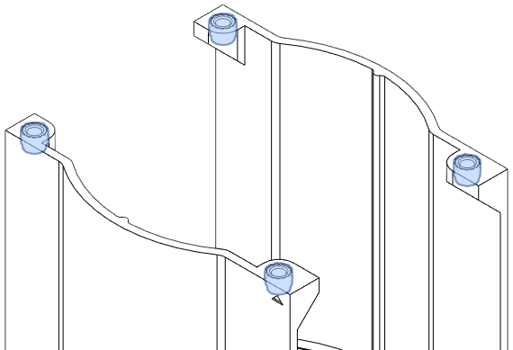
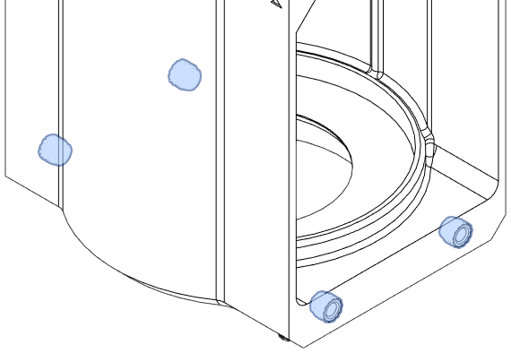
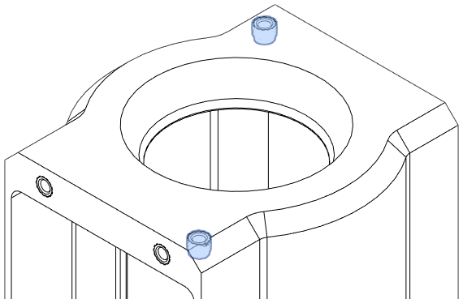
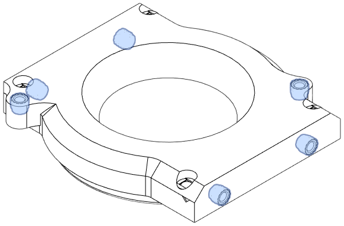
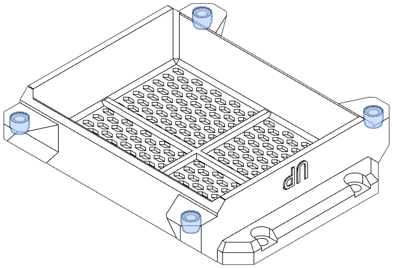

## main_body.stl

[{width="250px"}](../assets/img/inserts1.png)

[{width="250px"}](../assets/img/inserts2.png)

[{width="250px"}](../assets/img/inserts3.png)

## fan_cap.stl

[{width="250px"}](../assets/img/fan_cap.png)

## filter_base.stl

[{width="250px"}](../assets/img/filter.png)