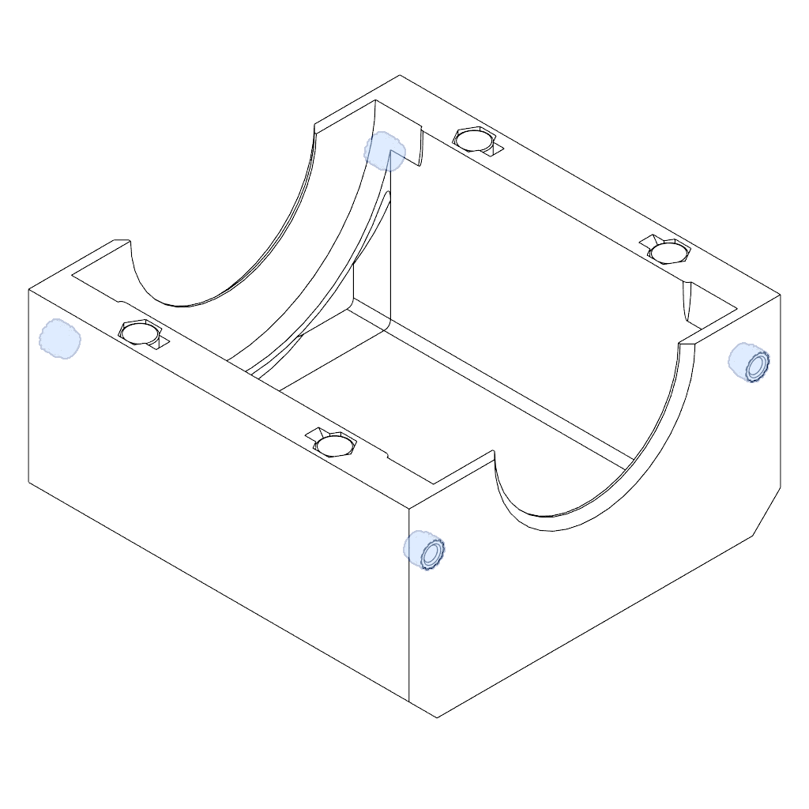
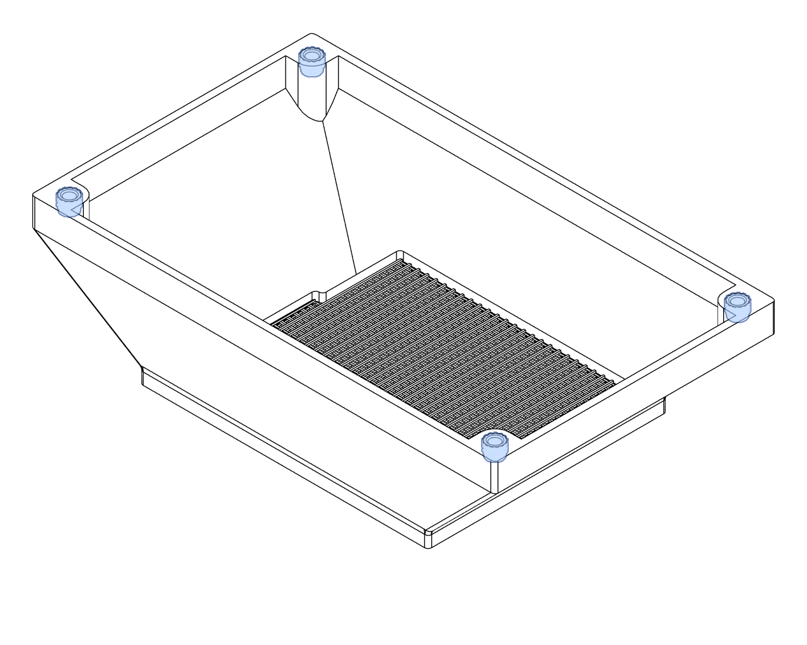
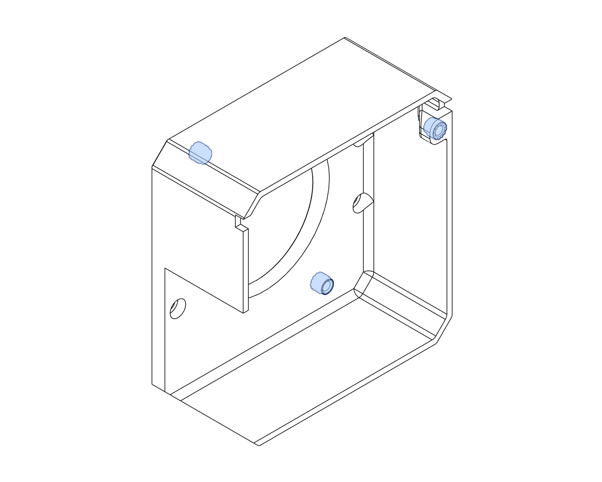
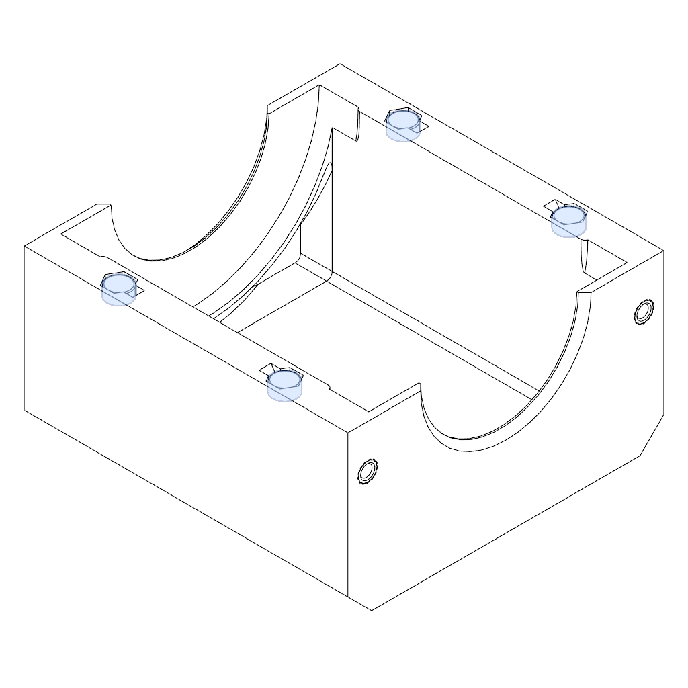
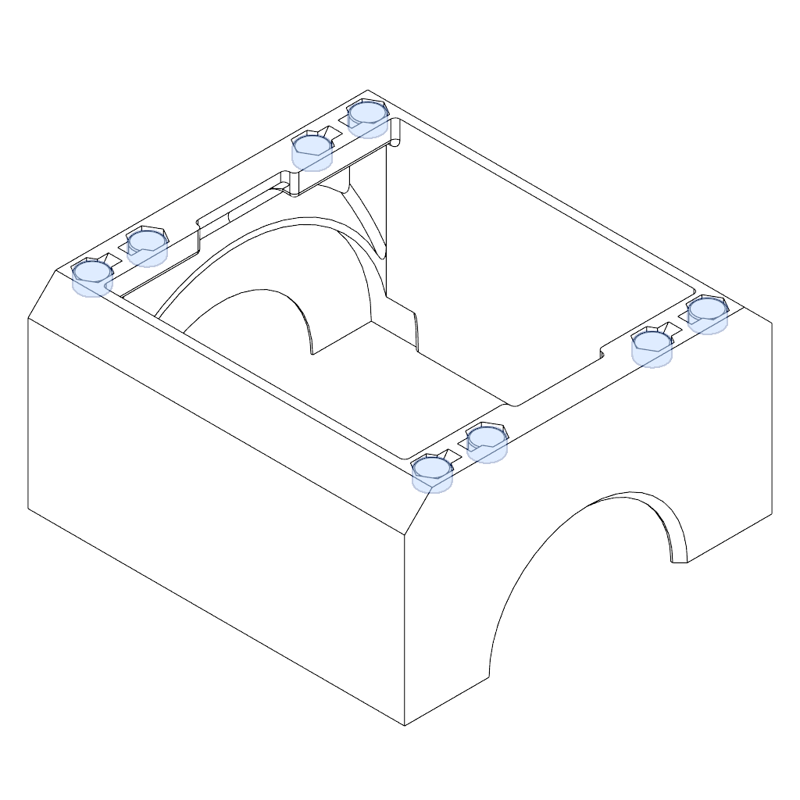
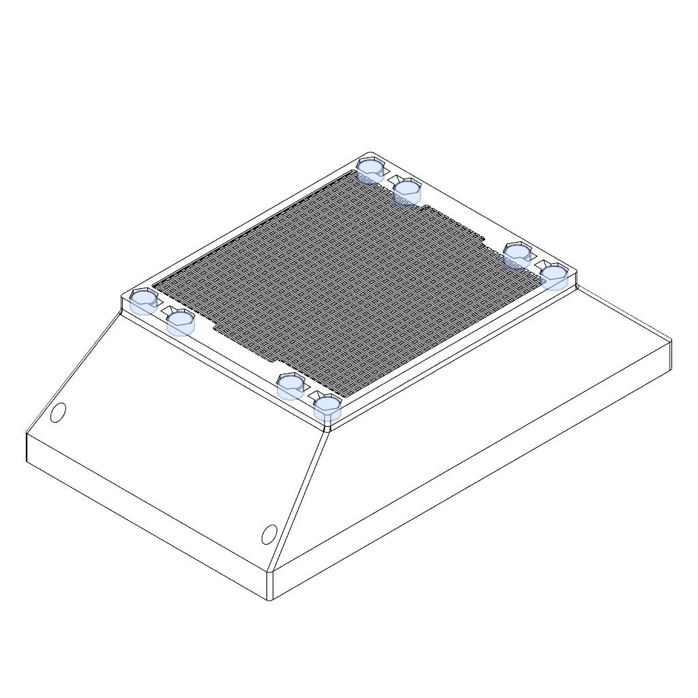

## Heat Set Inserts

<figure markdown>

<figcaption markdown>
Step 1. 
</figcaption>
</figure>

<figure markdown>

<figcaption markdown>
Step 2. 
</figcaption>
</figure>

<figure markdown>

<figcaption markdown>
Step 3. 
</figcaption>
</figure>

## Magnet Installation

<figure markdown>

<figcaption markdown>
Step 1. 
</figcaption>
</figure>

<figure markdown>

<figcaption markdown>
Step 2. 
</figcaption>
</figure>

<figure markdown>

<figcaption markdown>
Step 3. 
</figcaption>
</figure>

<figure markdown>

<figcaption markdown>
Step 4. 
</figcaption>
</figure>

## Fan Cage(s)

## AC Filter

## HEPA and Final Assembly

