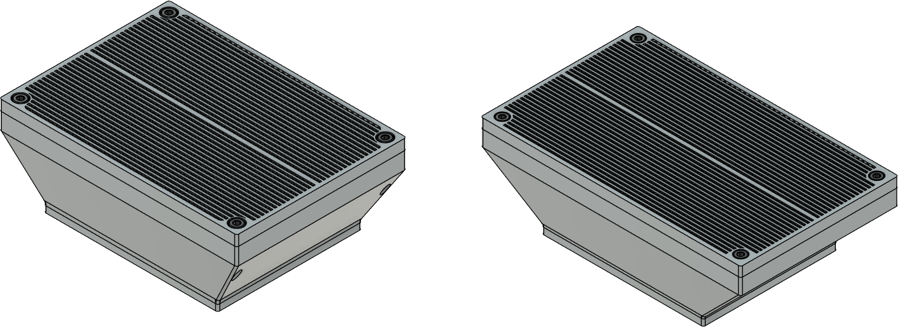

## Materials

| Part | Qty |
|------|-----|
| [Radial 75mm x 30mm fan][bom_7530_fan]            | 2 ea |
| [Moosoo XL-618A HEPA Filter][bom_hepa]            | 1 ea |
| M3 x 35mm SHCS                                    | 4 ea |
| M3 x 6mm SHCS                                     | 10 ea |
| [6mm x 3mm magnets][bom_magnet]                   | 24    |
| [Heat set inserts, M3 x 5mm x 4mm][bom_inserts]   | 14 ea |
| [Acid-free coconut shell activated carbon][bom_carbon] | < 0.5kg/1lb |
| :material-printer-3d-nozzle: [`main_body.stl`][stl_main_body]                  | 1 ea |
| :material-printer-3d-nozzle: [`fan_cap.stl`][stl_fan_cap]                      | 1 ea |
| :material-printer-3d-nozzle: [`fan_base.stl`][stl_fan_base]                    | 1 ea |
| :material-printer-3d-nozzle: [`filter_base.stl`][stl_filter_base]              | 2 ea |
| :material-printer-3d-nozzle: [`filter_cover.stl`][stl_filter_cover]            | 2 ea |

[v2_coupler]: https://github.com/jon-harper/air_filter/blob/main/STL/V2/Fan%20Cages/15mm%20CPAP%20Coupler.stl
[v2_ac_base_duo]: https://github.com/jon-harper/air_filter/blob/main/STL/V2/AC%20Filter/AC%20Base%20-%20Duo.stl
[v2_ac_base_solo]: https://github.com/jon-harper/air_filter/blob/main/STL/V2/AC%20Filter/AC%20Base%20-%20Solo.stl
[v2_ac_lid_duo]: https://github.com/jon-harper/air_filter/blob/main/STL/V2/AC%20Filter/AC%20Lid%20-%20Duo.stl
[v2_ac_lid_solo]: https://github.com/jon-harper/air_filter/blob/main/STL/V2/AC%20Filter/AC%20Lid%20-%20Solo.stl
[v2_fan_base]: https://github.com/jon-harper/air_filter/blob/main/STL/V2/Fan%20Cages/Fan%20Base.stl
[v2_fan_lid]: https://github.com/jon-harper/air_filter/blob/main/STL/V2/Fan%20Cages/Fan%20Lid.stl
[v2_filter_cap]: https://github.com/jon-harper/air_filter/blob/main/STL/V2/Fan%20Cages/Filter%20Cap.stl
[v2_hepa_top]: https://github.com/jon-harper/air_filter/blob/main/STL/V2/HEPA/HEPA%20Top.stl
[v2_bottom]: https://github.com/jon-harper/air_filter/blob/main/STL/V2/HEPA/HEPA%20Bottom.stl
[v2_bottom_wago]: https://github.com/jon-harper/air_filter/blob/main/STL/V2/HEPA/HEPA%20Bottom%20-%20Wagos.stl
[v2_bottom_2020]: https://github.com/jon-harper/air_filter/blob/main/STL/V2/HEPA/HEPA%20Bottom%20-%202020%20Mount.stl
[v2_bottom_2020_splitter]: https://github.com/jon-harper/air_filter/blob/main/STL/V2/HEPA/HEPA%20Bottom%20-%202020%20Mount%20with%20Splitter.stl
[v2_bottom_2020_wago]: https://github.com/jon-harper/air_filter/blob/main/STL/V2/HEPA/HEPA%20Bottom%20-%202020%20Mount%20with%20Wagos.stl