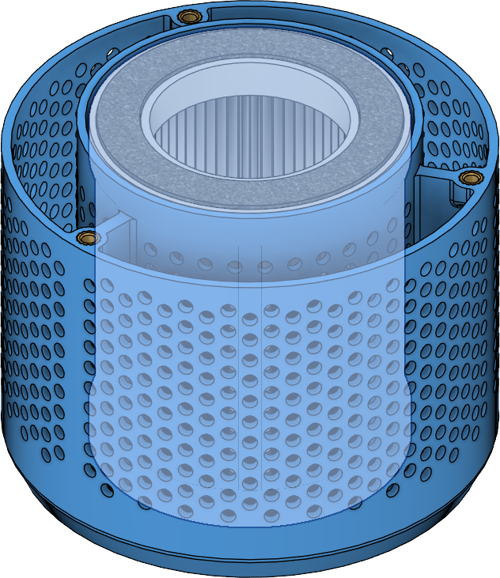
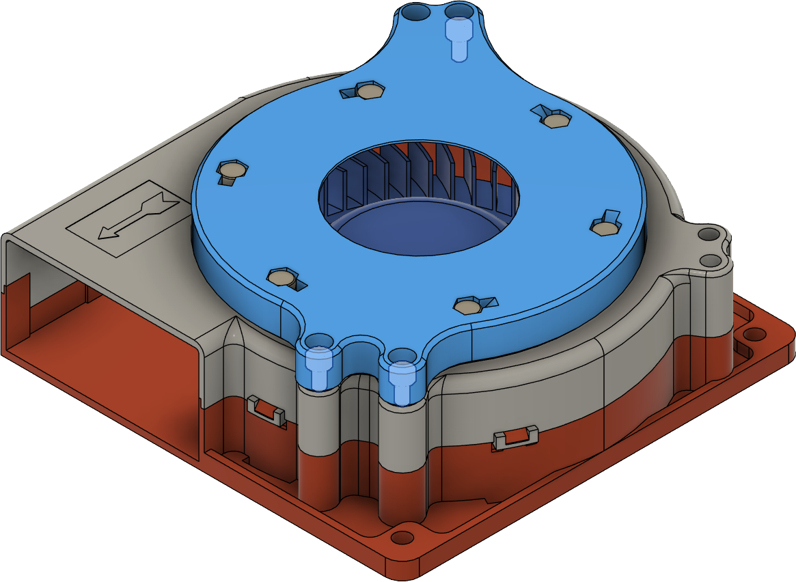

<figure markdown>
{width="50%"}
<figcaption markdown>
Step 1. Insert a HEPA filter into the center of the filter tank.
</figcaption>
</figure>

<figure markdown>
{width="50%"}
<figcaption markdown>
Step 2. Use a funnel to add activated carbon to the outer tank. Fill until the carbon covers the highlighted holes in the tank.
</figcaption>
</figure>

<figure markdown>
{width="50%"}
<figcaption markdown>
Step 3. Cover the filter tank with the lid. Secure with three (3) M3 x 6mm screws.
</figcaption>
</figure>

<figure markdown>
{width="50%"}
<figcaption markdown>
Step 4. Attach the base to the 120mm fan with **three (3)** M3 x 6mm screws.
</figcaption>
</figure>

<figure markdown>
{width="50%"}
<figcaption markdown>
Step 5. Snap the filter and base together. Your SUAFT 120 is now ready!
</figcaption>
</figure>

