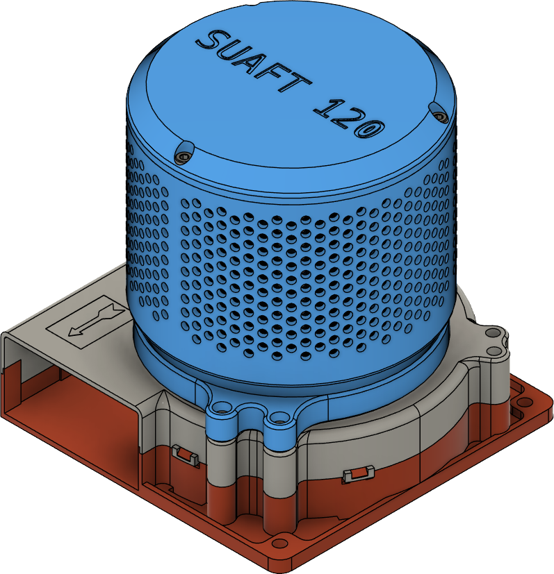

SUAFT 120 is an activated carbon and HEPA filter for 3D printer enclosures. SUAFTs are designed to be simple, cheap, and efficient; v3 builds on v1 with a sleeker design and easier disassembly.

## Goals

1. Be simple and efficient.
2. Be easy to build.
3. Be cheap to source.

## Bill of Materials

The filter can be printed for single or dual fan operation. Use a single fan assembly for compact printers (200x200 bed or smaller) or ones with limited free space. High flow and larger volume printers should use dual fans.

[SUAFT 120 Bill of Materials](bom.md){ .md-button }

## Materials

Material choice is guided by enclosure operating temperature.

- CF-ASA, CF-ABS: >80C
- ASA: >60C
- ABS: >45C. Avoid with active heaters.
- PETG: <45C or chamber floor. PETG filters should be considered a temporary solution (expected to fail with time). Do not use with active heaters.

## Assembly
 
[Preparation](prep.md){ .md-button }

[Assembly](assembly.md){ .md-button }