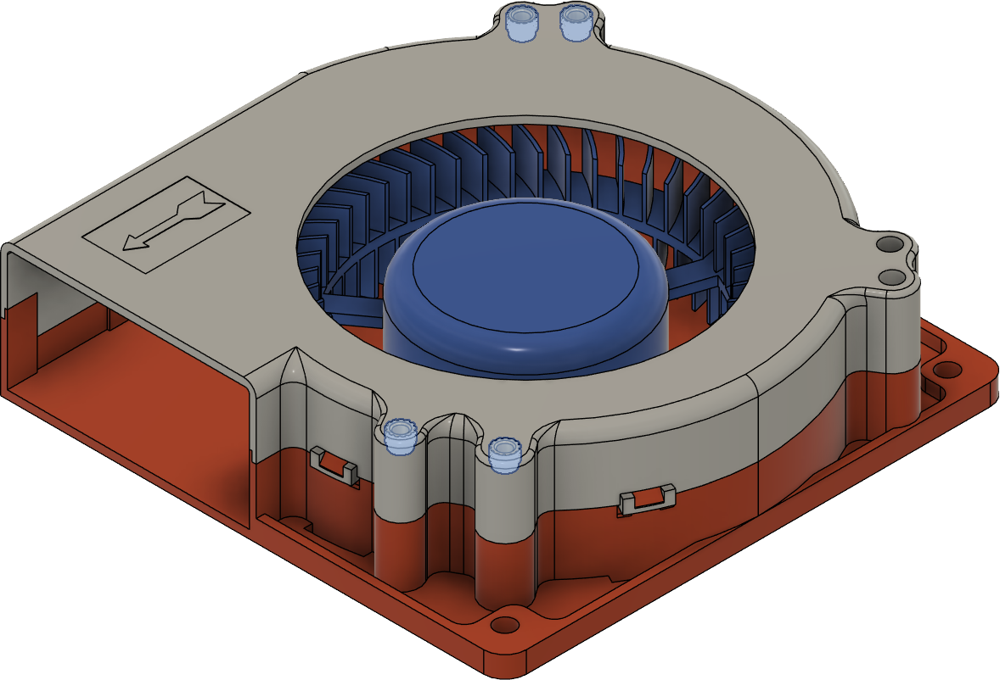
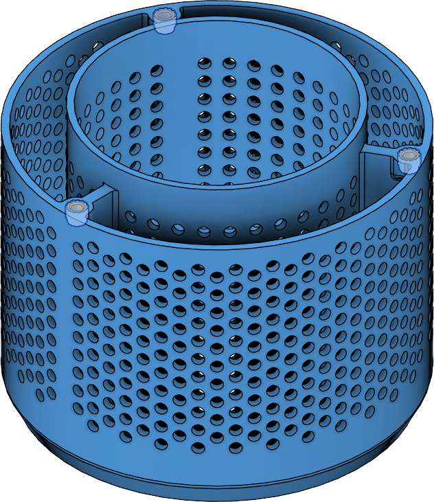
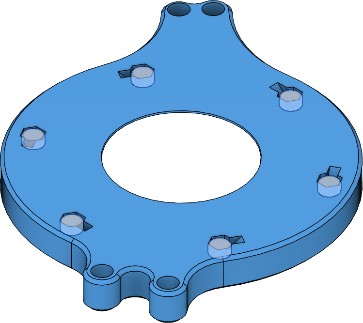
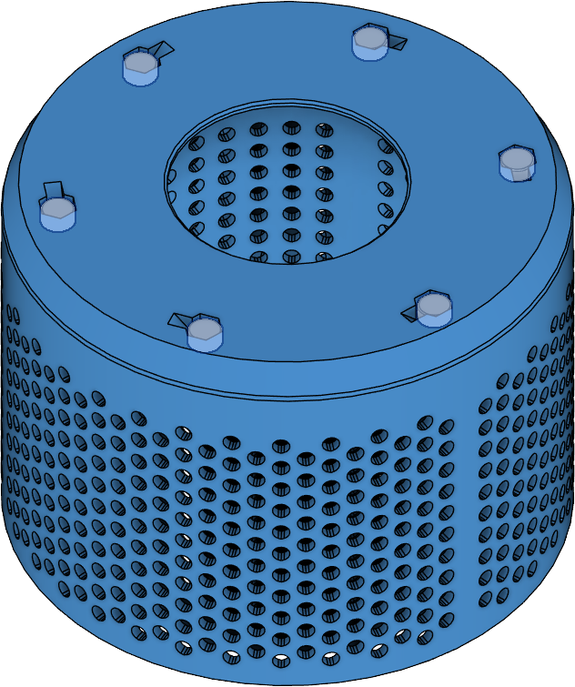

## Heat Set Inserts

<figure markdown>
{width="50%"}
<figcaption markdown>
Step 1. Install heat set inserts into three (3) of the four (4) highlighted holes in the fan. The fourth may be left unused.
</figcaption>
</figure>

<figure markdown>
{width="50%"}
<figcaption markdown>
Step 2. Install heat set inserts into the three (3) highlighted holes in the fitler cage.
</figcaption>
</figure>

## Magnet Installation

<figure markdown>
{width="50%"}
<figcaption markdown>
Step 1. Fix magnets into the six (6) highlighted locations. **It is strongly recommended that the polarity of the magnets are all oriented the same direction.**
</figcaption>
</figure>

<figure markdown>
{width="50%"}
<figcaption markdown>
Step 2. Fix magnets into the six (6) highlighted locations. **These magnets must have the same orientation as the base magnets.**
</figcaption>
</figure>

<figure markdown>
{width="50%"}
<figcaption markdown>
Step 3. Test that the filter and base snap together properly. Once any issues are fixed, optionally add a drop of super glue to the highlighted well area next to each magnet; this will help ensure magnets do not come loose.
</figcaption>
</figure>
